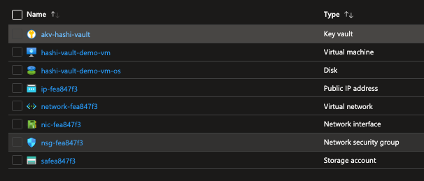
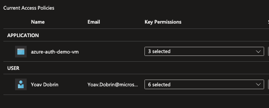
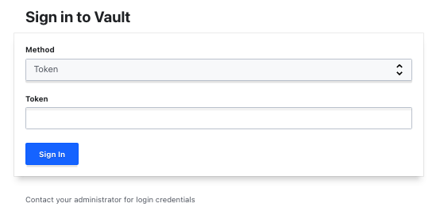

# Hashicorp Vault - autoseal using Azure KeyVault

This repo would spin up an Ubuntu VM with Hashicorp Vault as a service, configured to unseal with Azure keyVault, with all required resources.

As an ISVs using Vault for their secret storage, avoiding services which are not available across multiple clouds and their respective APIs. Instead I want to use the same SDK for my secrets management, and have an underline service control my seal/unseal of the vault.

Using Vault by hashicorp would allow my developers to focus on single set of API calls.

## Features

This project framework provides the following features:

* Creation of all required resources to use Hashicorp Vault with Azure KeyVault for auto seal.
* Configuration of the VM.

## Getting Started

### Prerequisites

* Azure subscription
* Resource group

### Quick Start

-Clone this repo to your local machine ```git clone https://github.com/yodobrin/vault```

-Change directory to ```../hashicorp-vault-autoseal/deploy/bicep```

-Modify the file ```param.json``` and replace the values to match your settings.

-Run this command :```- az deployment group create --resource-group <your-rg-name> --template-file main.bicep --parameters @param.json```

Your newly created resource group should look something like this:



## KeyVault Access

There are two ways you can allow the vault to access the KeyVault:

* Use dedicated SPN, grant it Get, Wrap & Un-Wrap roles.
* Use System Assigned managed identity of the VM hosting the vault - preffered method.

In this repo, the preffered option is outlined.

Verify that in the newly created KeyVault:

* A key was created (witht the name outlined in the variable file).

* The access policy is allowing you (the user executing terraform) and the system assigned identity Get, Wrap & Unwrap roles.

Examine the KeyVault access policy, it should show something like this:



## Vault configuration

While the Bicep/terraform script provision all resources required (and configure them) the final steps are to be executed manually. One of the reasons is to enable the operator to aquire required tokens & recovery keys.

> The user mentioned here might be diffrent from the one you create.

* ssh to the vm ```ssh azureuser@<ip provided as output>```

* Check the vault status by ```vault status```. You might need to restart the vault service (as it might finishined creation before the key in the keyvault) - ```sudo systemctl restart vault```

* Initilize the vault ```vault operator init``` this will output 5 recovery keys and an access token required to access the UI, save them. The output from this operation would look like this:

```bash
azureuser@hashi-vault-demo-vm:~$ vault operator init
Recovery Key 1: xxxxxxxxxxxxxxxxxxxxxxxxxxxxxxxxxxxxxxxxxxxx
Recovery Key 2: xxxxxxxxxxxxxxxxxxxxxxxxxxxxxxxxxxxxxxxxxxxx
Recovery Key 3: xxxxxxxxxxxxxxxxxxxxxxxxxxxxxxxxxxxxxxxxxxxx
Recovery Key 4: xxxxxxxxxxxxxxxxxxxxxxxxxxxxxxxxxxxxxxxxxxxx
Recovery Key 5: xxxxxxxxxxxxxxxxxxxxxxxxxxxxxxxxxxxxxxxxxxxx

Initial Root Token: xxxxxxxxxxxxxxxxxxxxxxxxxxxxx

Success! Vault is initialized


Recovery key initialized with 5 key shares and a key threshold of 3. Please
securely distribute the key shares printed above.
```

4.If you need to restart the vault use: ```sudo systemctl restart vault```

5.To check logs you can run: ```sudo journalctl --no-pager -u vault```

Accessing the UI can be done via: http://ip-of-the-vm:8200. Use the token saved earlier to access.



## Resources

The idea was initialy taken from this [GitHub repository](https://github.com/hashicorp/vault). More information can be found ath this [Website](https://www.vaultproject.io).
